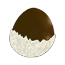
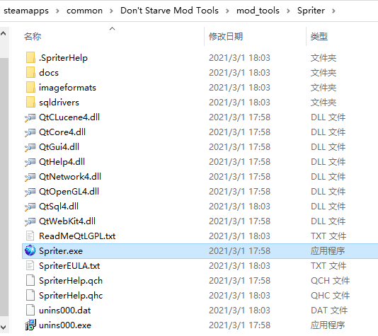
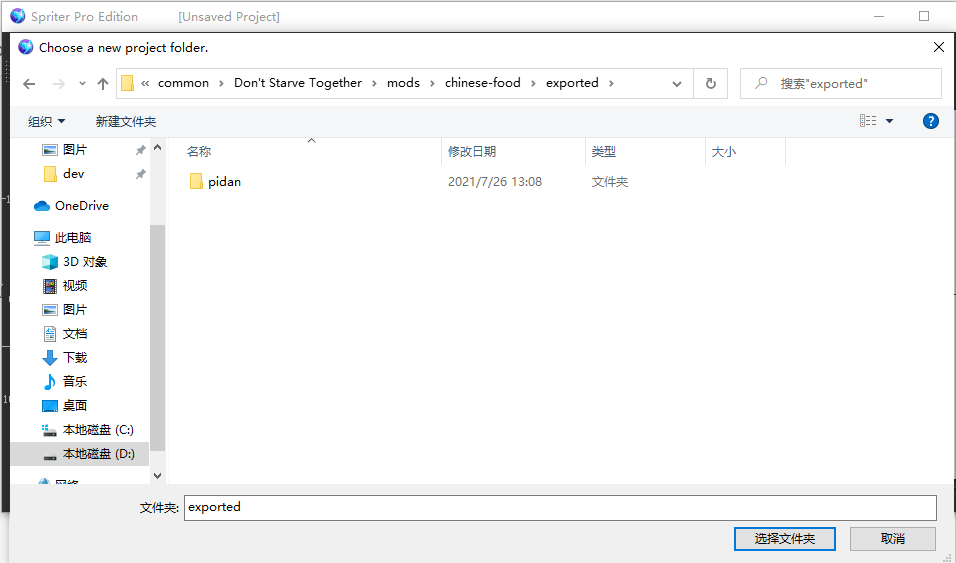
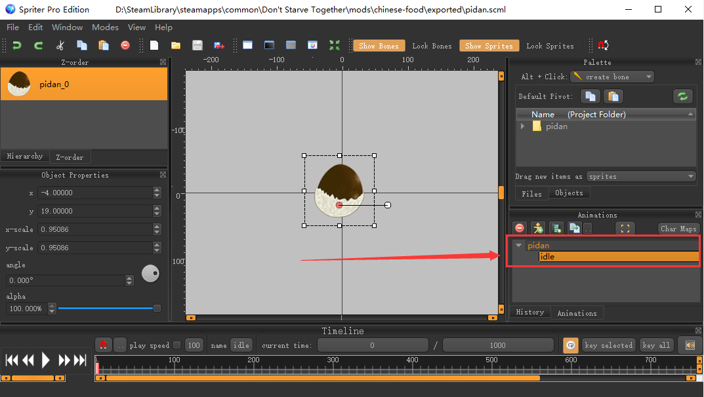
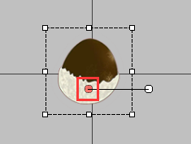
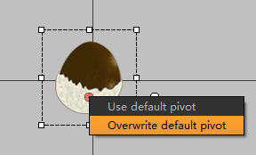
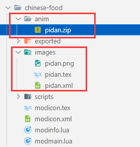
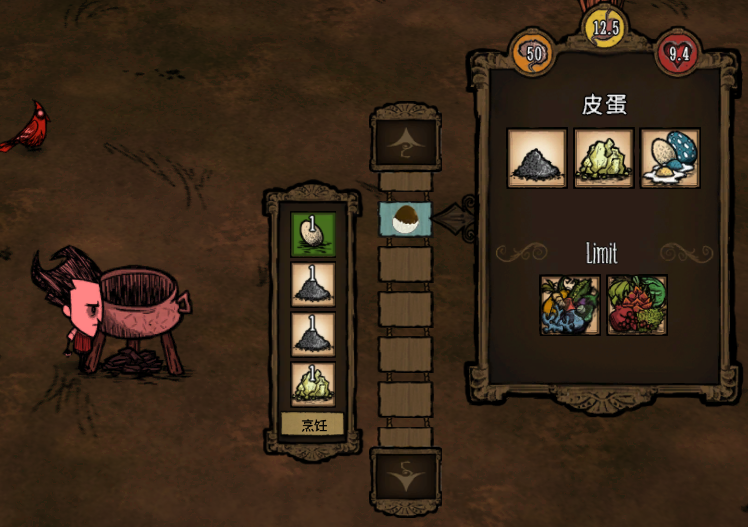
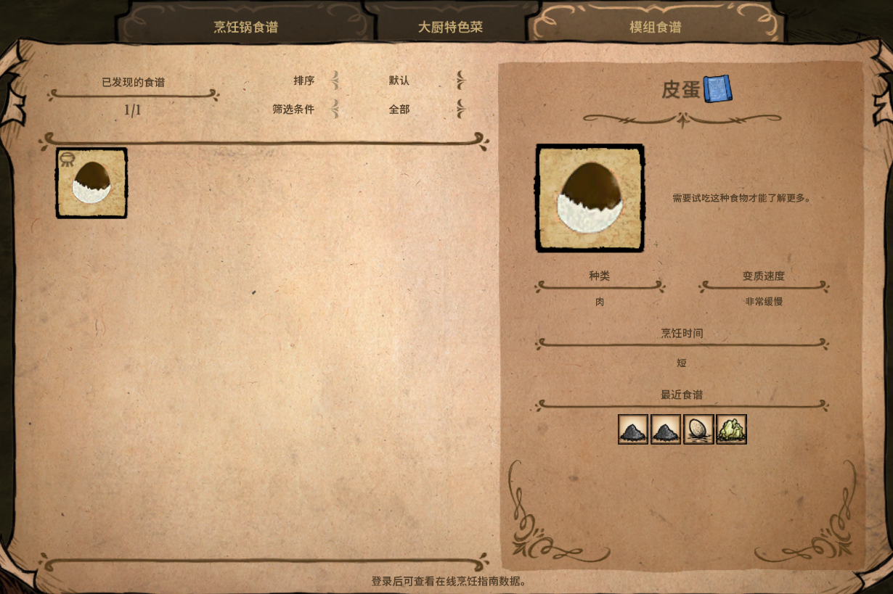

做饥荒食谱要用到两个api，在常用api那篇里有介绍

- AddIngredientValues(names, tags, cancook, candry)
- AddCookerRecipe(cooker, recipe)

第一个是定义料理需要食谱的材料的，游戏内置的那些食材都是定义好的，就不需要再定定义了，所以只要mod食谱里用到的全都是游戏内置的食材，AddIngredientValues 这个函数就用不上

第二个是将mod食谱添加到游戏内食谱里去

## 准备

首先要准备一张食材的图，我就以皮蛋来做例子，所以在网上找了张皮蛋的卡通图



用PS将其改为两个尺寸的大小，`64*64`，`112*112`

`64*64` 这个大小用于在智能锅中显示或者用作背包里的贴图，文件名为`pidan.png`

`112*112` 这个大小用来做动画，没有动画的话，当把料理放在地上的时候，就什么也看不见了 文件名为`pidan_0.png`

接着创建mod文件夹 `chinese-food`

## 处理素材

在创建的mod文件夹里创建一个 `images` 文件夹，将 `64*64` 大小的图放在里面

再在mod文件夹里创建一个 `exported` 的文件夹，然后在exported里再创建一个 `pidan` 的文件夹，将 `112*112` 大小的图放在 `pidan` 里面

然后打开 `Don't Starve Mod Tools` 里的 Spriter 软件



在 Spriter 软件里创建一个项目，目录选择 `exported`




然后在右边Animations面板里将动画名改成 `pidan` 并在其下创建 `idle` 动画，选中 idle 然后将右上 `Project folder` 里的图拖拽到面板里



选中面板中的图，会看到一个红色的圆点



如果这个红点不在中间偏下的位置，使用鼠标将其拖动到上图所示位置，**然后对红点右键，选择Overwrite default pivot**



最后一步，运行 `Don't Starve Mod Tools` 里的 `autocompiler.exe` 自动处理贴图，动画

生成好之后，在 images 文件夹下会多出 `pidan.tex` `pidan.xml`，且在mod文件夹下会多出一个文件夹 `anim` 里面有个 `pidan.zip`



## 代码

modinfo.lua 里还是固定写法，照着 `创建第一个mod` 那篇来即可

皮蛋的配方我定为 `蛋 x1，灰 x2, 硝石 x1`

原版游戏里 灰和硝石是没法入锅的，所以这里就要借助 `AddIngredientValues`函数来让灰和硝石成为食材

modmain.lua
```lua
AddIngredientValues({"nitre"}, { -- 硝石
    inedible = 1 -- inedible：不可食用的
})
AddIngredientValues({"ash"}, { -- 灰
    inedible = 1
})
```

有了这两行后，灰和硝石就能入锅了

然后定义食谱

modmain.lua
```lua
local pidan = {
    test = function(cooker, names, tags)
        return tags.egg and names.nitre and names.ash and not tags.veggie and not tags.fruit
    end,
    name = "pidan", -- 料理名
    weight = 1, -- 食谱权重
    priority = 1, -- 食谱优先级
    foodtype = GLOBAL.FOODTYPE.MEAT, --料理的食物类型，比如这里定义的是肉类
    health = TUNING.CALORIES_TINY, --吃后回血值
    hunger = TUNING.CALORIES_SMALL, --吃后回饥饿值
    sanity = TUNING.SANITY_HUGE, --吃后回精神值
    perishtime = TUNING.PERISH_SUPERSLOW, --腐烂时间
    cooktime = 0.5, --烹饪时间
    potlevel = "high",
    cookbook_tex = "pidan.tex", -- 在游戏内食谱书里的mod食物那一栏里显示的图标，tex在 atlas的xml里定义了，所以这里只写文件名即可
    cookbook_atlas = "images/pidan.xml",
    -- temperature = TUNING.HOT_FOOD_BONUS_TEMP, --某些食物吃了之后有温度变化，则是在这地方定义的
    -- temperatureduration = TUNING.FOOD_TEMP_BRIEF,
    floater = {"med", nil, 0.55},
    cookbook_category = "cookpot"
}

AddCookerRecipe("cookpot", pidan) -- 将食谱添加进普通锅
AddCookerRecipe("portablecookpot", pidan) -- 将食谱添加进便携锅
```

一切都准备好了，就差皮蛋的预制体了，毕竟就算能做出来，但在游戏里没有皮蛋这个预制体，锅也不知道你做了个啥，换句话说就是游戏里没有皮蛋这么个玩意

下面就来创建一个皮蛋

在mod文件夹下创建 `scripts/prefabs` 两个文件夹，然后在prefabs文件夹里创建`pidan.lua`

```lua
-- 加载贴图，动画
local assets = {Asset("ANIM", "anim/pidan.zip"), Asset("IMAGE", "images/pidan.tex"), Asset("ATLAS", "images/pidan.xml")}

function fn()
    local assetname = "pidan"

    local inst = CreateEntity() -- 创建实体
    inst.entity:AddTransform() -- 添加xyz形变对象
    inst.entity:AddAnimState() -- 添加动画状态

    MakeInventoryPhysics(inst)

    inst.AnimState:SetBank(assetname) -- 地上动画
    inst.AnimState:SetBuild(assetname) -- 材质包，就是anim里的zip包
    inst.AnimState:PlayAnimation("idle") -- 默认播放哪个动画

    MakeInventoryFloatable(inst)
    --------------------------------------------------------------------------
    if not TheWorld.ismastersim then
        return inst
    end
    --------------------------------------------------------------------------
    inst:AddComponent("inspectable") -- 可检查组件
    inst:AddComponent("inventoryitem") -- 物品组件

    inst.components.inventoryitem.atlasname = "images/pidan.xml" -- 在背包里的贴图

    inst:AddComponent("edible") -- 可食物组件
    inst.components.edible.foodtype = FOODTYPE.MEAT

    inst:AddComponent("perishable") -- 可腐烂的组件
    inst.components.perishable:SetPerishTime(TUNING.PERISH_SUPERSLOW)
    inst.components.perishable:StartPerishing()
    inst.components.perishable.onperishreplacement = "spoiled_food" -- 腐烂后变成腐烂食物

    inst.components.edible.hungervalue = TUNING.CALORIES_SMALL
    inst.components.edible.healthvalue = TUNING.CALORIES_TINY
    inst.components.edible.sanityvalue = TUNING.SANITY_HUGE

    inst:AddComponent("stackable") -- 可堆叠
    inst.components.stackable.maxsize = TUNING.STACK_SIZE_SMALLITEM

    MakeHauntableLaunch(inst)

    return inst
end

return Prefab("pidan", fn, assets, prefabs)
```

定义好prefab后，还没完，还要在modmain.lua里引入定义的文件

modmain.lua
```lua
PrefabFiles = {"pidan"}
```

到此一个皮蛋的食谱就被添加到游戏里了，进游戏就能用锅使用对应的食材制作了，细心的会发现还少了点啥

## 语言

进游戏制作出来的皮蛋鼠标放上去都是英文的，按alt点击人物说话也没有文本，下面就来添加不同语言的支持

在mod文件夹下创建 `languages` 文件夹，然后再创建两个文件 `chs.lua` `en.lua`

chs.lua
```lua
STRINGS.NAMES.PIDAN = "皮蛋"  -- 皮蛋的名字
STRINGS.CHARACTERS.GENERIC.DESCRIBE.PIDAN = "吃一口，神清气爽" -- 按alt检查时人物说的话
```

en.lua
```lua
STRINGS.NAMES.PIDAN = "Pidan"
STRINGS.CHARACTERS.GENERIC.DESCRIBE.PIDAN = "Chinese Food"
```

定义好之后，在modmain.lua里加载一下

modmain.lua
```lua
-- 默认加载中文简体，也可以通过mod菜单获取选择的语言来加载其它语言，换个名字即可
require "languages/chs"
```

## 测试





