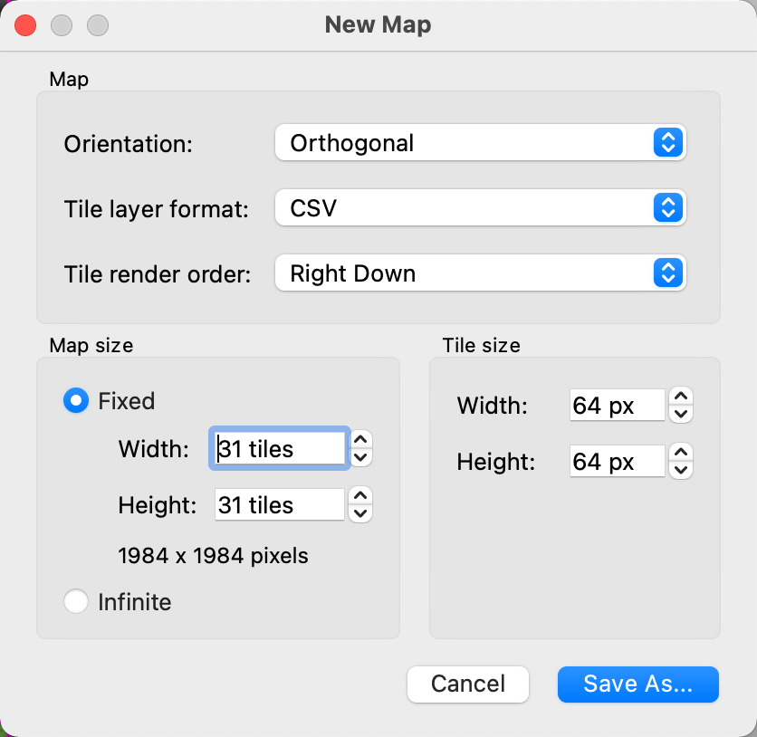
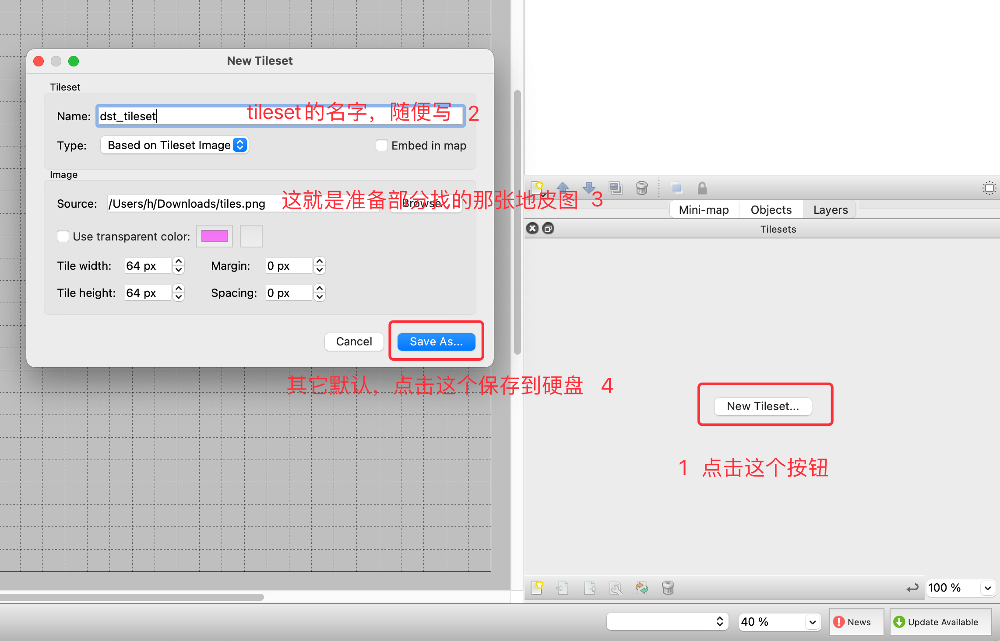
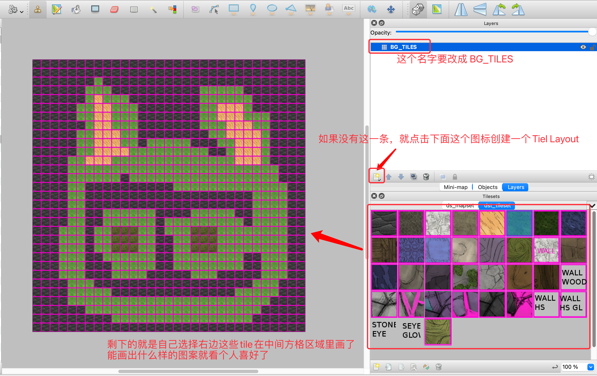
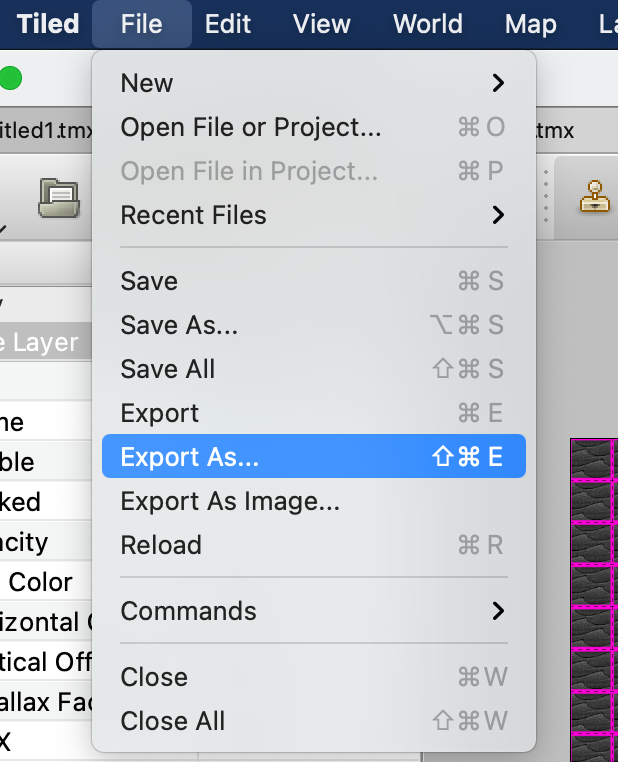
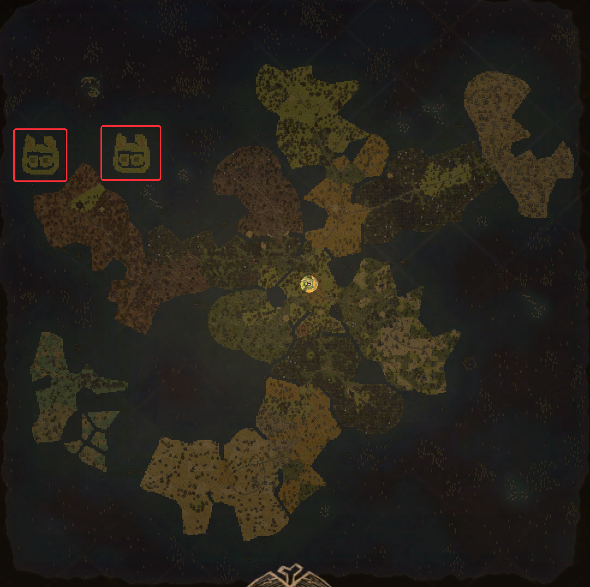

## 内置地皮

感谢 **五年一班 学会改变** 提供的地皮与编号对应图


## 准备

饥荒工具包里提供了一个tiled软件，它就是用来做地图的，不过它的版本太低了，我在官网上又下载了新版本的

tiled官网地址：https://mapeditor.org

它有三个平台的版本，选择自己需要的下载即可，安装

另外找到一张klei提供的地皮tiles.png图，位置如下图


## 地形类型

饥荒里有两种地形

**静态**

静态地形典型例子就是隐士岛，它在每个档里的形状都是那样，且上面生成的实体位置也都是固定的

**动态**

大陆地形上基本上都是动态生成的地形，每种地形在每个档里都不一样，且有的大点，有的小点，地形上的资源每个档都不一样，这种随机分布且大小随机资源随机的地形就是动态地形

创建自己的动态地形比较复杂，涉及到了room, task, level的相关操作

## 静态地形

原版里的隐士岛，神话mod里的桃岛，广寒宫，竹林都属于静态地形，下面就来介绍用tiled软件生成一张自己定义形状的地形

打开tiled，选择 file -> new map




在弹出窗口里，上面Map部分就按照图中选择，下面Map Size部分，左边是地形大小，右边是每个地皮的像素，这个像素后面会用来指定上面的生成资源位置

填完后，点击 Save as，将创建的一个地图文件保存在硬盘上随便一个位置（要保证自己能找到的）

然后创建tileset



接下来就是画地图了



全都画好之后，选择File -> Export as




到此地图文件就做好了

--------

创建一个mod，在文件文件夹里创建文件夹 `scripts/map/static_layouts`

然后在 `static_layouts` 文件夹里创建文件 `layout_cat.lua`，文件的内容就是刚导出的文件

```lua
return {
    version = "1.5",
    luaversion = "5.1",
    tiledversion = "1.6.0",
    orientation = "orthogonal",
    renderorder = "right-down",
    width = 31,
    height = 31,
    tilewidth = 64,
    tileheight = 64,
    nextlayerid = 2,
    nextobjectid = 1,
    properties = {},
    tilesets = {{
        name = "ds_mapset",
        firstgid = 1,
        filename = "ds_mapset.tsx"
    }},
    layers = {{
        type = "tilelayer",
        x = 0,
        y = 0,
        width = 31,
        height = 31,
        id = 1,
        name = "BG_TILES",
        visible = true,
        opacity = 1,
        offsetx = 0,
        offsety = 0,
        parallaxx = 1,
        parallaxy = 1,
        properties = {},
        encoding = "lua",
        data = {1, 1, 1, 1, 1, 1, 1, 1, 1, 1, 1, 1, 1, 1, 1, 1, 1, 1, 1, 1, 1, 1, 1, 1, 1, 1, 1, 1, 1, 1, 1, 1, 1, 1, 1,
                1, 1, 1, 1, 1, 1, 1, 1, 1, 1, 1, 1, 1, 1, 1, 1, 1, 1, 1, 1, 1, 1, 1, 1, 1, 1, 1, 1, 1, 1, 1, 1, 1, 1, 6,
                1, 1, 1, 1, 1, 1, 1, 1, 1, 1, 1, 1, 1, 1, 1, 1, 1, 1, 1, 1, 1, 1, 1, 1, 1, 1, 1, 1, 1, 6, 6, 6, 1, 1, 1,
                1, 1, 1, 1, 1, 1, 1, 6, 6, 6, 6, 6, 1, 1, 1, 1, 1, 1, 1, 1, 1, 1, 1, 1, 1, 6, 5, 6, 6, 6, 1, 1, 1, 1, 1,
                1, 1, 1, 6, 6, 6, 6, 6, 6, 1, 1, 1, 1, 1, 1, 1, 1, 1, 1, 1, 6, 6, 5, 5, 6, 6, 6, 1, 1, 1, 1, 1, 1, 1, 6,
                6, 5, 5, 5, 6, 1, 1, 1, 1, 1, 1, 1, 1, 1, 1, 1, 6, 6, 5, 5, 6, 6, 6, 1, 1, 1, 1, 1, 1, 1, 6, 6, 5, 5, 5,
                6, 6, 6, 1, 1, 1, 1, 1, 1, 1, 1, 1, 1, 6, 5, 5, 6, 6, 6, 1, 1, 1, 1, 1, 1, 1, 6, 6, 6, 5, 5, 5, 6, 6, 1,
                1, 1, 1, 1, 1, 1, 1, 1, 6, 6, 5, 5, 5, 6, 6, 1, 1, 1, 1, 1, 1, 1, 1, 6, 6, 5, 5, 5, 5, 6, 1, 1, 1, 1, 1,
                1, 1, 1, 1, 6, 6, 5, 5, 5, 6, 6, 1, 6, 6, 6, 6, 6, 1, 1, 1, 6, 6, 5, 5, 5, 6, 1, 1, 1, 1, 1, 1, 1, 1, 1,
                6, 6, 5, 5, 5, 5, 6, 6, 6, 6, 6, 6, 6, 6, 6, 1, 1, 6, 5, 5, 5, 6, 1, 1, 1, 1, 1, 1, 1, 1, 6, 6, 5, 5, 5,
                6, 6, 6, 6, 6, 6, 6, 6, 6, 6, 6, 6, 6, 6, 5, 5, 5, 6, 1, 1, 1, 1, 1, 1, 1, 1, 6, 6, 6, 6, 6, 6, 6, 6, 6,
                6, 6, 6, 6, 6, 6, 6, 6, 6, 6, 6, 6, 6, 6, 6, 1, 1, 1, 1, 1, 1, 1, 6, 6, 6, 6, 6, 6, 1, 6, 6, 6, 6, 6, 6,
                6, 6, 6, 6, 6, 6, 6, 6, 6, 6, 6, 1, 1, 1, 1, 1, 1, 1, 6, 6, 1, 1, 1, 1, 1, 1, 1, 1, 1, 1, 6, 6, 6, 6, 6,
                6, 6, 6, 6, 6, 6, 6, 6, 1, 1, 1, 1, 1, 1, 6, 6, 1, 1, 1, 1, 1, 1, 1, 1, 1, 1, 1, 1, 1, 1, 1, 1, 1, 1, 1,
                6, 6, 6, 6, 1, 1, 1, 1, 1, 1, 6, 6, 1, 1, 1, 1, 1, 1, 1, 1, 1, 1, 1, 1, 1, 1, 1, 1, 1, 1, 1, 6, 6, 6, 6,
                1, 1, 1, 1, 1, 1, 6, 6, 1, 1, 6, 6, 6, 6, 6, 6, 1, 1, 1, 1, 6, 6, 6, 6, 6, 1, 1, 6, 6, 6, 6, 1, 1, 1, 1,
                1, 1, 6, 6, 1, 1, 6, 6, 6, 6, 6, 6, 1, 6, 6, 6, 6, 6, 6, 6, 6, 6, 1, 6, 6, 6, 6, 1, 1, 1, 1, 1, 6, 6, 6,
                1, 6, 6, 14, 14, 14, 6, 6, 1, 6, 6, 6, 14, 14, 14, 6, 6, 6, 6, 6, 6, 6, 6, 1, 1, 1, 1, 1, 6, 6, 6, 1, 6,
                6, 14, 14, 14, 6, 6, 1, 1, 6, 6, 14, 14, 14, 6, 6, 6, 6, 6, 6, 6, 6, 1, 1, 1, 1, 1, 6, 6, 6, 1, 6, 6,
                14, 14, 14, 6, 6, 1, 1, 6, 6, 14, 14, 14, 6, 6, 6, 6, 6, 6, 6, 6, 1, 1, 1, 1, 1, 6, 6, 6, 1, 1, 6, 6, 6,
                6, 6, 6, 1, 1, 6, 6, 6, 6, 6, 6, 6, 6, 1, 1, 6, 6, 6, 1, 1, 1, 1, 1, 6, 6, 6, 1, 1, 1, 6, 6, 6, 6, 6, 1,
                1, 6, 6, 6, 6, 6, 6, 6, 6, 1, 1, 6, 6, 6, 1, 1, 1, 1, 1, 6, 6, 6, 1, 1, 1, 6, 6, 6, 6, 1, 1, 1, 1, 1, 6,
                6, 6, 1, 1, 1, 1, 1, 6, 6, 6, 1, 1, 1, 1, 1, 1, 6, 6, 6, 1, 1, 1, 1, 1, 1, 1, 1, 1, 1, 1, 1, 1, 1, 1, 1,
                1, 1, 6, 6, 6, 1, 1, 1, 1, 1, 1, 1, 6, 6, 6, 6, 6, 1, 1, 1, 1, 1, 1, 1, 1, 1, 1, 1, 1, 1, 1, 6, 6, 6, 6,
                6, 1, 1, 1, 1, 1, 1, 1, 6, 6, 6, 6, 6, 6, 6, 6, 6, 6, 6, 6, 6, 6, 6, 6, 6, 6, 6, 6, 6, 6, 6, 1, 1, 1, 1,
                1, 1, 1, 1, 1, 1, 6, 6, 6, 6, 6, 6, 6, 6, 6, 6, 6, 6, 6, 6, 6, 6, 6, 6, 6, 6, 1, 1, 1, 1, 1, 1, 1, 1, 1,
                1, 1, 1, 1, 1, 6, 6, 6, 6, 6, 6, 6, 6, 6, 6, 6, 6, 6, 6, 6, 6, 1, 1, 1, 1, 1, 1, 1, 1, 1, 1, 1, 1, 1, 1,
                1, 1, 1, 1, 1, 1, 1, 1, 1, 1, 1, 1, 1, 1, 1, 1, 1, 1, 1, 1, 1, 1, 1}
    }}
}
```

然后在mod文件夹里创建文件 `modworldgenmain.lua`

```lua
require("map/tasks")
require("map/lockandkey")

local Layouts = require("map/layouts").Layouts
local StaticLayout = require("map/static_layout")

-- 将刚定义的地图放在静态地图表里
Layouts["CAT_HOME"] = StaticLayout.Get("map/static_layouts/layout_cat", {
    start_mask = GLOBAL.PLACE_MASK.IGNORE_IMPASSABLE_BARREN_RESERVED,
    fill_mask = GLOBAL.PLACE_MASK.IGNORE_IMPASSABLE_BARREN_RESERVED,
    layout_position = GLOBAL.LAYOUT_POSITION.CENTER,
    disable_transform = true
})

-- 将刚定义的地图添加到主世界里，放在ocean_prefill_setpieces这个对象里，隐士岛的静态地图也是放在这个对象里
-- ocean_prefill_setpieces 这个对象里的地形都是随机生成在海上的
AddLevelPreInitAny(function(level)
    if level.location == "forest" then -- forest 是森林，就是主世界
        if level.ocean_prefill_setpieces ~= nil then
            level.ocean_prefill_setpieces["CAT_HOME"] = {count = 2} -- count 表示要生成几个
        end
    end
end)
```

进游戏创建世界看看效果



地形生成好了，但上面还是光秃秃的，也不好看，下面就来在上面指定位置生成一些东西吧

> 在地形上定义生成的实体的方式有两种，一种是自己算坐标，硬写，一种是进游戏，通过控制台把相应的物品资源都生成好，然后扫描地图获取坐标来直接使用
>
> 第二种方式可以参见教程：https://www.bilibili.com/read/cv4336821
>
> 我这就简单点介绍一下怎么定义的，就随便指定一下坐标了

坐标计算，前面在tiled软件里创建地图的时候，选择了 31x31大小，每个tile的大小都是64x64像素的，所以坐标可选范围就是 (0,0) - (1980,1980)

下面就是修改生成好的地图文件了，在`layers`对象里再定义一个对象，类型是 `objectgroup` ，名字是 `FG_OBJECTS` 为什么是它们呢？因为隐士岛里写的就是这个

```lua
return {
    version = "1.5",
    luaversion = "5.1",
    tiledversion = "1.6.0",
    orientation = "orthogonal",
    renderorder = "right-down",
    width = 31,
    height = 31,
    tilewidth = 64,
    tileheight = 64,
    nextlayerid = 2,
    nextobjectid = 1,
    properties = {},
    tilesets = {{
        name = "ds_mapset",
        firstgid = 1,
        filename = "ds_mapset.tsx"
    }},
    layers = {{
        type = "tilelayer",
        x = 0,
        y = 0,
        width = 31,
        height = 31,
        id = 1,
        name = "BG_TILES",
        visible = true,
        opacity = 1,
        offsetx = 0,
        offsety = 0,
        parallaxx = 1,
        parallaxy = 1,
        properties = {},
        encoding = "lua",
        data = {1, 1, 1, 1, 1, 1, 1, 1, 1, 1, 1, 1, 1, 1, 1, 1, 1, 1, 1, 1, 1, 1, 1, 1, 1, 1, 1, 1, 1, 1, 1, 1, 1, 1, 1,
                1, 1, 1, 1, 1, 1, 1, 1, 1, 1, 1, 1, 1, 1, 1, 1, 1, 1, 1, 1, 1, 1, 1, 1, 1, 1, 1, 1, 1, 1, 1, 1, 1, 1, 6,
                1, 1, 1, 1, 1, 1, 1, 1, 1, 1, 1, 1, 1, 1, 1, 1, 1, 1, 1, 1, 1, 1, 1, 1, 1, 1, 1, 1, 1, 6, 6, 6, 1, 1, 1,
                1, 1, 1, 1, 1, 1, 1, 6, 6, 6, 6, 6, 1, 1, 1, 1, 1, 1, 1, 1, 1, 1, 1, 1, 1, 6, 5, 6, 6, 6, 1, 1, 1, 1, 1,
                1, 1, 1, 6, 6, 6, 6, 6, 6, 1, 1, 1, 1, 1, 1, 1, 1, 1, 1, 1, 6, 6, 5, 5, 6, 6, 6, 1, 1, 1, 1, 1, 1, 1, 6,
                6, 5, 5, 5, 6, 1, 1, 1, 1, 1, 1, 1, 1, 1, 1, 1, 6, 6, 5, 5, 6, 6, 6, 1, 1, 1, 1, 1, 1, 1, 6, 6, 5, 5, 5,
                6, 6, 6, 1, 1, 1, 1, 1, 1, 1, 1, 1, 1, 6, 5, 5, 6, 6, 6, 1, 1, 1, 1, 1, 1, 1, 6, 6, 6, 5, 5, 5, 6, 6, 1,
                1, 1, 1, 1, 1, 1, 1, 1, 6, 6, 5, 5, 5, 6, 6, 1, 1, 1, 1, 1, 1, 1, 1, 6, 6, 5, 5, 5, 5, 6, 1, 1, 1, 1, 1,
                1, 1, 1, 1, 6, 6, 5, 5, 5, 6, 6, 1, 6, 6, 6, 6, 6, 1, 1, 1, 6, 6, 5, 5, 5, 6, 1, 1, 1, 1, 1, 1, 1, 1, 1,
                6, 6, 5, 5, 5, 5, 6, 6, 6, 6, 6, 6, 6, 6, 6, 1, 1, 6, 5, 5, 5, 6, 1, 1, 1, 1, 1, 1, 1, 1, 6, 6, 5, 5, 5,
                6, 6, 6, 6, 6, 6, 6, 6, 6, 6, 6, 6, 6, 6, 5, 5, 5, 6, 1, 1, 1, 1, 1, 1, 1, 1, 6, 6, 6, 6, 6, 6, 6, 6, 6,
                6, 6, 6, 6, 6, 6, 6, 6, 6, 6, 6, 6, 6, 6, 6, 1, 1, 1, 1, 1, 1, 1, 6, 6, 6, 6, 6, 6, 1, 6, 6, 6, 6, 6, 6,
                6, 6, 6, 6, 6, 6, 6, 6, 6, 6, 6, 1, 1, 1, 1, 1, 1, 1, 6, 6, 1, 1, 1, 1, 1, 1, 1, 1, 1, 1, 6, 6, 6, 6, 6,
                6, 6, 6, 6, 6, 6, 6, 6, 1, 1, 1, 1, 1, 1, 6, 6, 1, 1, 1, 1, 1, 1, 1, 1, 1, 1, 1, 1, 1, 1, 1, 1, 1, 1, 1,
                6, 6, 6, 6, 1, 1, 1, 1, 1, 1, 6, 6, 1, 1, 1, 1, 1, 1, 1, 1, 1, 1, 1, 1, 1, 1, 1, 1, 1, 1, 1, 6, 6, 6, 6,
                1, 1, 1, 1, 1, 1, 6, 6, 1, 1, 6, 6, 6, 6, 6, 6, 1, 1, 1, 1, 6, 6, 6, 6, 6, 1, 1, 6, 6, 6, 6, 1, 1, 1, 1,
                1, 1, 6, 6, 1, 1, 6, 6, 6, 6, 6, 6, 1, 6, 6, 6, 6, 6, 6, 6, 6, 6, 1, 6, 6, 6, 6, 1, 1, 1, 1, 1, 6, 6, 6,
                1, 6, 6, 14, 14, 14, 6, 6, 1, 6, 6, 6, 14, 14, 14, 6, 6, 6, 6, 6, 6, 6, 6, 1, 1, 1, 1, 1, 6, 6, 6, 1, 6,
                6, 14, 14, 14, 6, 6, 1, 1, 6, 6, 14, 14, 14, 6, 6, 6, 6, 6, 6, 6, 6, 1, 1, 1, 1, 1, 6, 6, 6, 1, 6, 6,
                14, 14, 14, 6, 6, 1, 1, 6, 6, 14, 14, 14, 6, 6, 6, 6, 6, 6, 6, 6, 1, 1, 1, 1, 1, 6, 6, 6, 1, 1, 6, 6, 6,
                6, 6, 6, 1, 1, 6, 6, 6, 6, 6, 6, 6, 6, 1, 1, 6, 6, 6, 1, 1, 1, 1, 1, 6, 6, 6, 1, 1, 1, 6, 6, 6, 6, 6, 1,
                1, 6, 6, 6, 6, 6, 6, 6, 6, 1, 1, 6, 6, 6, 1, 1, 1, 1, 1, 6, 6, 6, 1, 1, 1, 6, 6, 6, 6, 1, 1, 1, 1, 1, 6,
                6, 6, 1, 1, 1, 1, 1, 6, 6, 6, 1, 1, 1, 1, 1, 1, 6, 6, 6, 1, 1, 1, 1, 1, 1, 1, 1, 1, 1, 1, 1, 1, 1, 1, 1,
                1, 1, 6, 6, 6, 1, 1, 1, 1, 1, 1, 1, 6, 6, 6, 6, 6, 1, 1, 1, 1, 1, 1, 1, 1, 1, 1, 1, 1, 1, 1, 6, 6, 6, 6,
                6, 1, 1, 1, 1, 1, 1, 1, 6, 6, 6, 6, 6, 6, 6, 6, 6, 6, 6, 6, 6, 6, 6, 6, 6, 6, 6, 6, 6, 6, 6, 1, 1, 1, 1,
                1, 1, 1, 1, 1, 1, 6, 6, 6, 6, 6, 6, 6, 6, 6, 6, 6, 6, 6, 6, 6, 6, 6, 6, 6, 6, 1, 1, 1, 1, 1, 1, 1, 1, 1,
                1, 1, 1, 1, 1, 6, 6, 6, 6, 6, 6, 6, 6, 6, 6, 6, 6, 6, 6, 6, 6, 1, 1, 1, 1, 1, 1, 1, 1, 1, 1, 1, 1, 1, 1,
                1, 1, 1, 1, 1, 1, 1, 1, 1, 1, 1, 1, 1, 1, 1, 1, 1, 1, 1, 1, 1, 1, 1}
    }, {
        type = "objectgroup",
        name = "FG_OBJECTS",
        visible = true,
        opacity = 1,
        properties = {},
        objects = {{
            name = "",
            type = "evergreen", -- 预制体的名字，这个是常青树的预制体名字
            shape = "rectangle", -- 形状，貌似所有的实体都是这个形状，距形
            x = 444, -- x坐标
            y = 766, -- y坐标
            width = 0,
            height = 0,
            visible = true, -- 是否可见
            properties = {}
        }, {
            name = "",
            type = "grass", -- 预制体的名字，这个是䓍的预制体名字
            shape = "rectangle", -- 形状，貌似所有的实体都是这个形状，距形
            x = 798, -- x坐标
            y = 682, -- y坐标
            width = 0,
            height = 0,
            visible = true, -- 是否可见
            properties = {}
        }}
    }}
}
```

进游戏看效果


## 动态地形

//TODO


