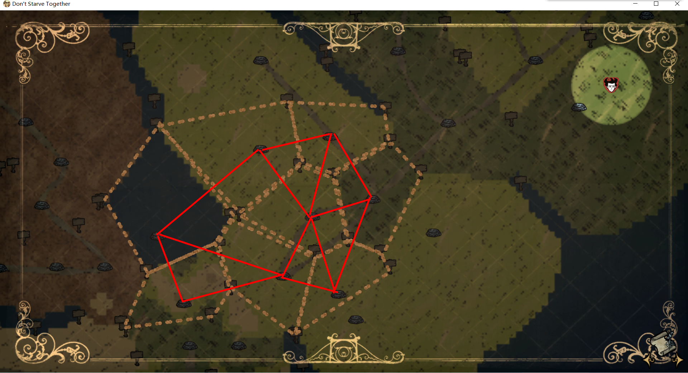

> 声明：本篇文章是来自`五年一班 月`通过读源码总结出的

大家有没有好奇过

- 为啥一上月岛，背景音乐就变了
- 为啥夏天去沙漠地形立即就刮起了沙尘暴
- 眼骨为啥会刷新在固定地形上
- 茶几为啥刷新位置也是在固定的地形上

## 检测地形节点

玩家身上有个组件 `areaaware` ，这个组件会每帧去检查当前玩家所处的区域，然后根据不同区域的标签来做一些处理（比如更换背景音乐，触发沙尘暴，反转SAN值等）

关于地图上的节点，有如下这些（有可能还有其它的）

**陆地**

- Chester_Eyebone 切斯特骨眼
- StagehandGarden 舞台

**月岛**

- moonhunt 月岛
- nohasslers 无障碍的
- lunacyarea 精神异常
- not_mainland 不在大陆
- ForceDisconnected 强制断开
- RoadPoison 道路恶化

**蚁狮沙漠**

- sandstorm 沙尘暴
- RoadPoison

**其它**

- ExitPiece 最多单标签节点
- nohunt 禁止狩猎
- nohasslers 没有麻烦

对应源码文件 `scripts/map/maptags.lua`

## room,level,task

- room 节点
- level 世界（地上是森林，地下是洞穴，还有目前关闭的 熔炉，暴食）
- task 地区 （比如沙漠地形，森林地形，混合地形等）

level由taks组成，taks由room组成（比如蚁狮沙漠。它由多个room组成，绿洲room，蚁狮刷新点room等）

生成世界的时候，从众多节点中选择一些相近节点组成的节点集，作为组成世界的room。

在游戏中，节点的体现如下图所示，每个虚线的区域就是一个room，一个room一般周围会有5个room相邻



下图是生成这类地图的算法（比如饥荒，缺氧的地图都是这种算法生成的），名为：Voronoi 有兴趣可以去这个网站了解更多 https://www.redblobgames.com/


## 自定义room,task,level

借助api `AddTask()` `AddLevel()` `AddRoom()` 可以添加自定义的task,level,room

大致用法如下

```lua
AddLevel(LEVELTYPE,{  --世界类型
	id = "", --世界ID
	name = "", --世界名称
	desc = "", --世界说明
	overrides =  {}, --覆盖世界设置
	override_triggers =  {}, --覆盖仅在触发时发生
	substitutes=   {},--  level替代品
	tasks=  {}, --保证产生的关卡任务
	optionaltasks =   {}, --随机选择的任务
	numoptionaltasks =  0 ， --选择的随机任务数
	set_pieces =   {}, --设置保证产生的碎片
	random_set_pieces =   {},  --设置随机选择的片段
	numrandom_set_pieces =  0, --选择的随机设置的数量
	ordered_story_setpieces =  { }, --传送产生的镶嵌物
	required_prefabs =   {}, --确保显示所需的预制件（EX传送组件）
	teleportaction =  nil, --使用Teleportato时要采取的动作
	teleportmaxwell =  nil, --释放角色时将角色设置为maxwell，属于冒险模式？
	min_playlist_position =  0, --冒险模式下的最小播放列表位置
	max_playlist_position =  999, --冒险模式下的最大播放列表位置
	background_node_range =  { 0 ,2}, --minimum和最大BG节点每个任务的数
})
```

```lua
AddRoom("", { --节点名称
	colour={r=.45,g=.5,b=.85,a=.50}, --颜色？
	value =, -- 节点的地面
	tags = {}, -- 节点的标签，用于探险地图和遗迹
	contents =  { -- 节点内容清单
		custom_tiles={} -- 用于更复杂的节点，特别是在洞穴中。
		countstaticlayouts = {} -- 数和 类型的静态布局在一个节点
		countprefabs= {}, -- 创建预制件以放置在节点中

		distributepercent = 0,-- 要分发的项目的密度
		distributeprefabs = {}-- 要分发的物品及其频率

		prefabdata = {} --用于在预制件上定义更具体的信息
	}
})
```

```lua
AddTask("", {  -- 地形名称
	locks = LOCKS , --  locks地形
	keys_given = KEYS ,--  keys一个地形给出的
	entrance_room_chance =  0 , --进入节点的机会
	entrance_room =  { } , --那个入口节点应该是什么
	room_choices = { } , --地形中的节点
	room_bg = GROUND, -地板
	background_room = "", --后台节点
	color = {r = 0 , g = 0 , b = 0 , a = 0 }  --调试功能
	make_loop =  false --假-导致一个圆环形的地形
	crosslink_factor =  0 --确定交联系数
	maze_tiles =  {}  --在迷宫中使用
 })
```

```lua
INVALID = 255,
IMPASSABLE = 1,
c_give("FUNGUS",1)
ROAD = 2, 卵石路
ROCKY = 3, 岩石地皮
DIRT = 4, 沙漠地皮
SAVANNA = 5,热带草原地皮
GRASS = 6, 长草地皮
FOREST = 7,森林地皮
MARSH = 8, 沼泽地皮
WEB = 9,
WOODFLOOR = 10, 木地板
CARPET = 11,
CHECKER = 12,

-- CAVES
CAVE = 13, 鸟粪地皮
FUNGUS = 14,菌类地皮
FUNGUSRED = 24,
FUNGUSGREEN = 25,
SINKHOLE = 15,粘滑地皮
UNDERROCK = 16,洞穴岩石地皮
MUD = 17,泥泞地皮
BRICK = 18,
BRICK_GLOW = 19,
TILES = 20,
TILES_GLOW = 21,
TRIM = 22,
TRIM_GLOW = 23,


--EXPANDED FLOOR TILES
DECIDUOUS = 30,桦树地皮
DESERT_DIRT = 31,
SCALE = 32,

LAVAARENA_FLOOR = 33,
LAVAARENA_TRIM = 34,

QUAGMIRE_PEATFOREST = 35,
QUAGMIRE_PARKFIELD = 36,
QUAGMIRE_PARKSTONE = 37,
QUAGMIRE_GATEWAY = 38,
QUAGMIRE_SOIL = 39,
QUAGMIRE_CITYSTONE = 41,

PEBBLEBEACH = 42,岩石海滩地皮
METEOR = 43,月球环山地皮
SHELLBEACH = 44,贝壳海滩地皮

ARCHIVE = 45,远古月岛迷宫地皮
FUNGUSMOON = 46,

FARMING_SOIL = 47,

-- PUBLIC USE SPACE FOR MODS is 70 to 89 --

--NOISE -- from 110 to 127 -- TODO: move noise tile range to > 255
FUNGUSMOON_NOISE = 120,
METEORMINE_NOISE = 121,
METEORCOAST_NOISE = 122,
DIRT_NOISE = 123,
ABYSS_NOISE = 124,
GROUND_NOISE = 125,
CAVE_NOISE = 126,
FUNGUS_NOISE = 127,

UNDERGROUND = 128, -- todo: incrase this to OCEAN_START once WALL_X have been removed

WALL_ROCKY = 151,
WALL_DIRT = 152,
WALL_MARSH = 153,
WALL_CAVE = 154,
WALL_FUNGUS = 155,
WALL_SINKHOLE = 156,
WALL_MUD = 157,
WALL_TOP = 158,
WALL_WOOD = 159,
WALL_HUNESTONE = 160,
WALL_HUNESTONE_GLOW = 161,
WALL_STONEEYE = 162,
WALL_STONEEYE_GLOW = 163,

FAKE_GROUND = 200, -- todo: change to 254 and retrofit maps

-- OCEAN TILES [201, 247]
OCEAN_START = 201, -- enum for checking if tile is ocean water

-- KLEI OCEAN TILES [201, 230]
OCEAN_COASTAL = 201,
OCEAN_COASTAL_SHORE = 202,
OCEAN_SWELL = 203,
OCEAN_ROUGH = 204,
OCEAN_BRINEPOOL = 205,
OCEAN_BRINEPOOL_SHORE = 206,
OCEAN_HAZARDOUS = 207,

-- MODS OCEAN TILES [231, 247]  <--PUBLIC USE SPACE FOR MODS --

OCEAN_END = 247, -- enum for checking if
```

## 用处

```lua
-- 地图的定义对象
--[[
_G.TheWorld.topology:
	edgeToNodes
		编号1 = false or {编号1=1,编号2=2}
		...(总计:1414,每个地图不一样)
	ids
		编号1 = "Befriend the pigs:0:Marsh"
		...(268)
	colours
		编号 = {a=1,r=1,b=1,g=0}
		...(44)
	level_type SURVIVAL
	story_depths
		编号 = 数量？
		...(269) 编号269=0
	overrides (设置)
		"klaus" = "default"
		...
	flattenedPoints
		编号 = {100,-12}
		...(614)
	nodes
		编号 ={
			neighbours = {编号1=31...} --相邻节点
			type = 0/1/2...?
			c = 0/1/2...?
			tags = {编号1="ExitPiece"...}
			cent= {编号1=112.1，编号2=-121.5}
			y=-120
			x=-44
			poly={编号1={}...}--组成这个节点多边形的全部顶点坐标
			validedges={编号1=11，编号2=34...}
			area= 110 --地区编号？
		}
		...(268)
	edges
		编号1 = {n1=12,n2=4,c=1}
		...(288)
	flattenedEdges
		编号1 = false or {编号1=1,编号2=2}
		...(1414)
]]

-- 下面方法大致可以将地图某个节点给修改成月岛的地形（不是指换地皮，而是走在上面有月岛上的效果，比如周围有月灵，精神会反转）
AddPrefabPostInit("world",function(inst)
	inst:DoTaskInTime(0, function(inst)
        local topology = GLOBAL.TheWorld.topology
		for k,node in pairs(topology.nodes) do
			table.insert(node.tags, "lunacyarea")
		end
	end)
end)
```

> 猜测 借助 `scripts/map/storygen.lua` 里的方法应该也能对room添加标签或者修改一些地形的操作

